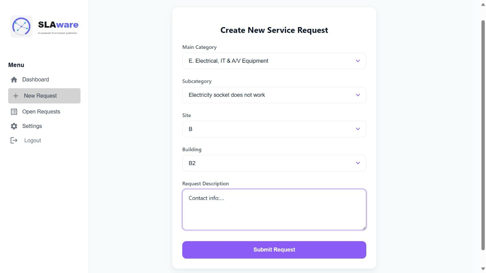
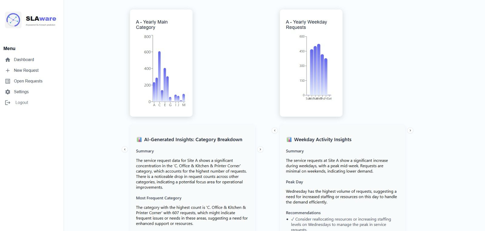
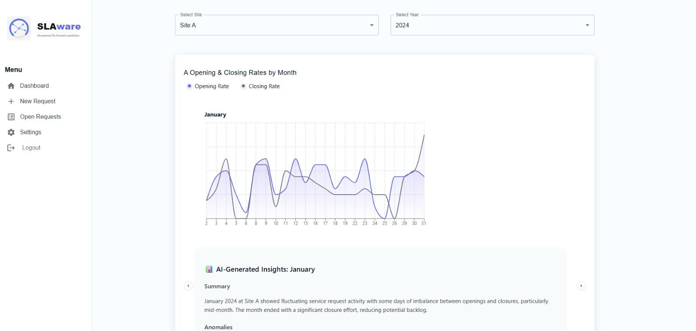
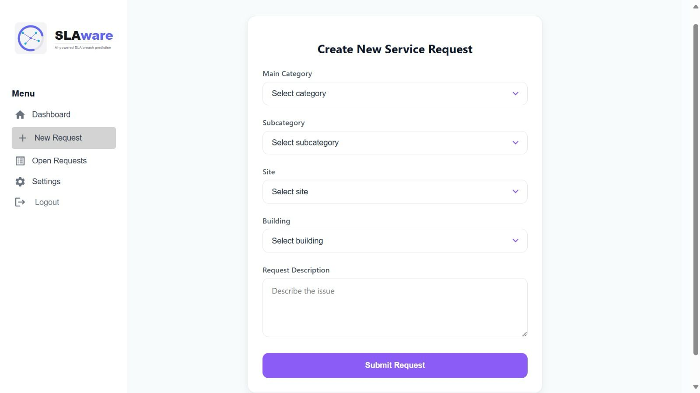

# SLA Anomaly Detection System

The **SLA Anomaly Detection System** is a real-time monitoring and prediction platform for detecting anomalies in Service Level Agreement (SLA) times for service requests. It analyzes historical data to predict potential delays, identifies issues during the service process, and provides actionable recommendations to improve efficiency and prevent bottlenecks.

## Technologies Used

- **Backend:** Flask (Python)
- **Frontend:** React with TypeScript
- **Database:** MongoDB
- **Machine Learning Models:**
  - XGBoost - Predicting SLA times
  - Random Forest - Anomaly detection
  - AdaBoost & Naive Bayes - Performance comparison

## Features

- 🔍 **Real-time monitoring** of service requests
- 🚀 **Anomaly detection** to identify issues before they escalate
- 📈 **AI-driven recommendations** for optimizing SLA performance
- 📊 **Interactive dashboard** for visualizing service status and bottlenecks
- 🔐 **Secure API endpoints** for data integration

## Installation

1. Clone the repository:
   ```bash
   git clone https://github.com/shirzohar/SLA-final-project-DS-Full-Stack.git
   cd SLA-final-project-DS-Full-Stack
   ```

2. Install the required dependencies:
   ```bash
   pip install -r requirements.txt
   npm install
   ```

3. Start the backend server:
   ```bash
   python app.py
   ```

4. Start the frontend application:
   ```bash
   npm start
   ```

## Usage

- Visit `http://localhost:3000` to access the application.
- The dashboard will display real-time SLA tracking, anomaly alerts, and optimization suggestions.
- Use the API to fetch real-time data and update service status.

## 📷 Screenshots





